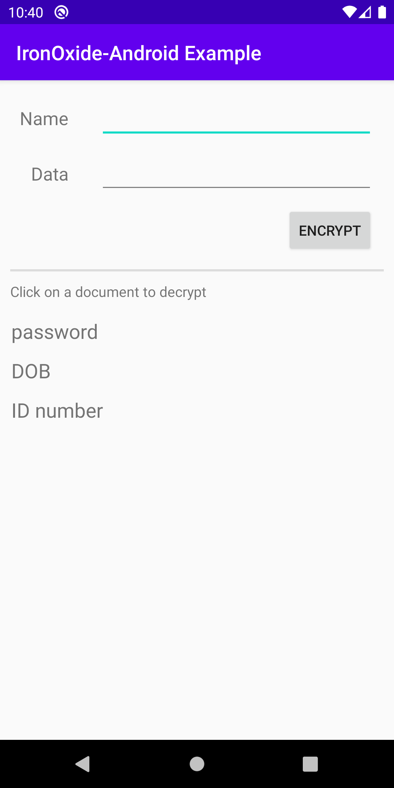

# IronOxide-Android Example Application

This application provides a simple UI for encrypting/decrypting data with IronCore's Android SDK. Its purpose is to give an example of depending on ironoxide-android, loading the native library, and making various SDK calls.



## Running locally

### Prerequisites

- Install Android SDK 29. You can get the command line SDK [here](https://developer.android.com/studio) (scroll down to "Command line tools only").
  - Note: **The extracted `tools` folder must follow a specific folder hierarchy. We recommend `AndroidCLI/cmdline-tools/tools`**.
- Install Android 29 build and platform tools. This can be done with `sdkmanager` (found in `tools/bin`):
  ```bash
  ./sdkmanager "build-tools;29.0.3" "platform-tools" "platforms;android-29"
  ```
- Create the file `$HOME/.gradle/gradle.properties` and add the line `sdk.dir=PATH_TO_ANDROID_CLI_FOLDER`.
- An Android emulator running, or a compatible Android phone connected.
  - To start an emulator using the command line tools, follow these steps from the folder `AndroidCLI/cmdline-tools/tools/bin`:
    1. `./sdkmanager "emulator" "system-images;android-29;google_apis;x86_64"`
    1. `./avdmanager create avd -n pixel_3 -k "system-images;android-29;google_apis;x86_64" -d pixel_3`
    1. `../../../emulator/emulator -avd pixel_3 -no-snapshot -noaudio -no-boot-anim`

### Directions

1. From the Example_Application root, run `./gradlew installDebug`.
1. From the emulator's app drawer, select the `ICL Demo` app.
1. Fill out the `Name` and `Data` fields and press the `Encrypt` button. A new entry will be added for this data below.
1. To decrypt an entry, select it from the list. A dialog will display the document's decrypted data as well as relevant metadata.
